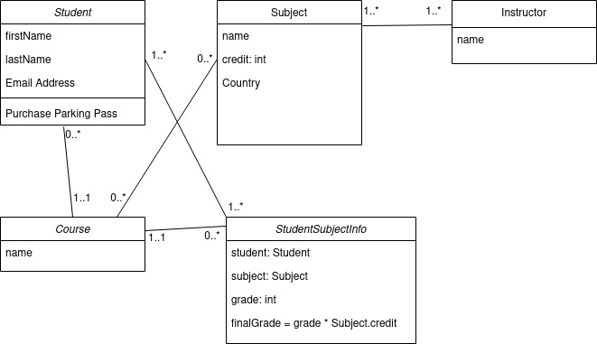

# About
This is a web application for college management. Some feature includes:
- the ability to manage (CRUD operation) student list for each course
- manage a course's subject list and instructor.

## Database
It uses a MySQL database to hold all the application's information. The script to create the sample data is in the _script.sql_ file. To use it:

	mysql -u <username> -p < script.sql	

This is the UML Class diagram.

## Resources & Tutorial
### JDBC: 
- https://docs.spring.io/spring-framework/docs/3.0.x/spring-framework-reference/html/jdbc.html
- https://docs.oracle.com/javase/tutorial/jdbc/basics/connecting.html
- https://docs.oracle.com/javase/tutorial/jdbc/basics/processingsqlstatements.html

# Try it!
You need [Java SDK v17][1] or higher and to install the [spring framework][2].

Run the application with

	./mvnw spring-boot:run

# Issues
Feel free to open an issue or to message me if you find any problems or have a feature request.

[1]: www.java.com 
[2]: https://spring.io/
